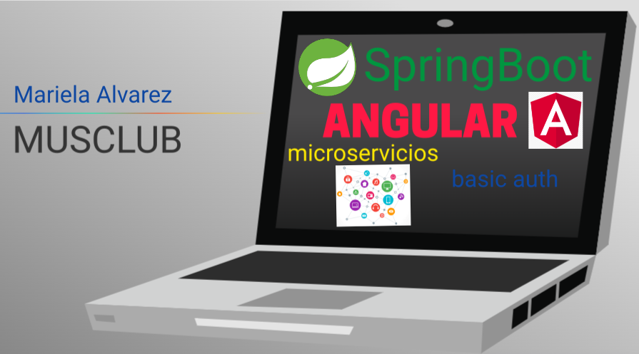
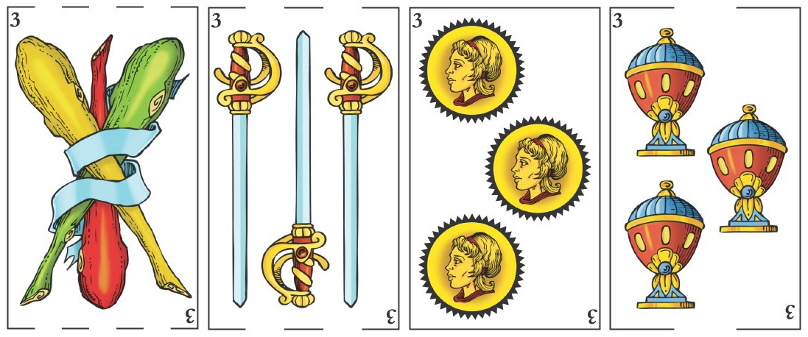

# MusClub




Un juego para todos.


## Descripción


MusClub es una aplicación para gestionar tus juegos de Mus.





## Para comenzar


### Requisitos


* Necesitas un ordenador, tablet o telefono móvil.

* Mac o Windows 10 es suficiente


### Instalación


* descarga el proyecto desde mi GitHub: 

```

https://github.com/maryalv21/MusClub

```


### Para ejecutar el programa


* Esta es una versión Beta con lo cual necesitas instalar un frontend en Visual

Studio y el backend en IntelliJ

```

MusClubFront es el Angular, el resto es el back end

```


## Desarrollado por


Mariela Alvarez

[GitHub](https://github.com/maryalv21)


## Versiones


* 0.1

    * Versión Beta


## Licencia


Este proyecto se llama [MUSCLUB] de momento no tiene licencia


## Tecnologías Utilizadas


* [Angular](https://angular.io/)

* [SpringBoot](https://spring.io/projects/spring-boot)

* [microservicios](#)

* [basic auth](#)